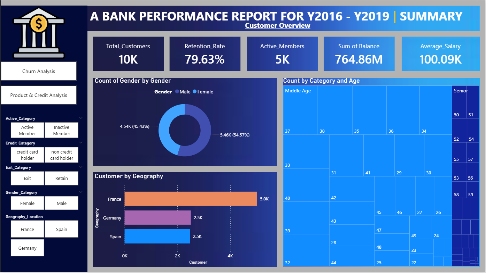
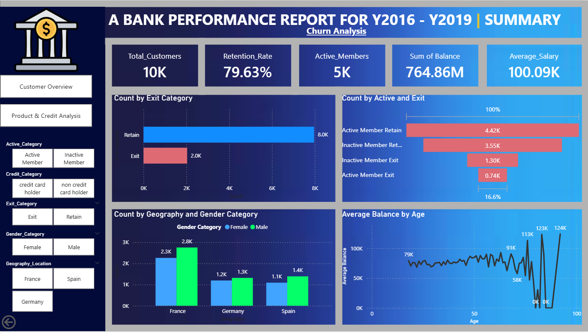

# Bank Customer Churn Analysis Dashboard (Power BI)

## Project Overview

Customer churn is a critical challenge for banks, as retaining existing customers is significantly more cost-effective than acquiring new ones. This project analyzes customer data to identify patterns and key factors influencing churn behavior.

The objective of this project is to build an **interactive Power BI dashboard** that helps stakeholders understand customer behavior, identify churn drivers, and develop strategies to improve customer retention.

The dashboard provides insights into **customer demographics, financial behavior, product usage, and activity patterns**, enabling data-driven decision making for banking management.

---

## Business Problem

Banks often lose customers due to factors such as poor engagement, limited product usage, or unsatisfactory service experiences. Understanding **why customers leave the bank** is essential for designing targeted retention strategies.

This project answers key business questions such as:

* Which customers are most likely to leave the bank?
* How does customer activity influence churn?
* Do balance, salary, or number of products affect retention?
* Which geographic regions show higher churn rates?

---

## Dataset Description

The dataset represents banking customers and their account details.

### Fact Table

**BankChurn**
Contains the main customer information including:

* Credit Score
* Age
* Tenure
* Balance
* Number of Products
* Estimated Salary

### Dimension Tables

| Table          | Description                  |
| -------------- | ---------------------------- |
| CustomerInfo   | Customer IDs and names       |
| Geography      | Customer country information |
| Gender         | Gender mapping               |
| CreditCard     | Credit card ownership status |
| ActiveCustomer | Customer activity status     |
| ExitCustomer   | Customer churn status        |

The dataset is structured using a **Star Schema data model** to improve performance and enable efficient filtering across visuals.

---

## Data Cleaning & Preparation

Data preprocessing was performed using **Power Query** to ensure data quality.

Key steps included:

* Removing duplicate records
* Handling missing or null values
* Standardizing column names
* Ensuring consistent ID relationships
* Validating numeric and categorical data types

These steps ensured the dataset was ready for analysis and visualization.

---

## Data Modeling

A **Star Schema** data model was implemented.

* **Fact Table:** BankChurn
* **Dimension Tables:** CustomerInfo, Geography, Gender, CreditCard, ActiveCustomer, ExitCustomer
* Relationships were created using **One-to-Many cardinality**

This structure improves **query performance and dashboard filtering capability**.

---

## DAX Calculations

### Calculated Columns

**Customer Age Group**

* Young
* Middle Age
* Senior

**Tenure Category**

* New Customer
* Loyal Customer

**Balance Status**

* Zero Balance
* Has Balance

### Measures

**Total Customers**
Counts the total number of customers.

**Exited Customers**
Counts customers who have left the bank.

**Retention Rate**
Percentage of customers retained by the bank.

**Average Balance**
Average account balance of customers.

**Average Salary**
Average estimated salary of customers.

---

## Dashboard Design

The dashboard consists of **three analytical pages** designed to answer key business questions.

### 1. Customer Overview

Provides a high-level summary of customer demographics and retention metrics.

Visualizations include:

* KPI Cards (Total Customers, Retention Rate, Active Member %)
* Gender Distribution (Donut Chart)
* Customers by Geography (Bar Chart)
* Age Group Distribution (Tree Map)

---

### 2. Churn Analysis

Focuses on understanding customer churn behavior.

Visualizations include:

* Exited vs Retained Customers (Clustered Bar Chart)
* Churn by Geography & Gender (Stacked Column Chart)
* Customer Activity Funnel (Active → Inactive → Exit)
* Average Balance vs Age (Line Chart)

---

### 3. Product & Credit Analysis

Analyzes how product adoption affects retention.

Visualizations include:

* Credit Card Ownership Distribution
* Exit Rate by Number of Products
* Geography vs Exit Rate (Matrix)
* Retention Rate Indicator (Gauge Chart)

---

## Key Insights

* **Inactive customers show the highest probability of churn**, highlighting the importance of customer engagement strategies.
* Customers with **only one banking product have the highest churn rate**, indicating strong cross-selling opportunities.
* **Low balance customers are more likely to leave**, suggesting financial engagement influences retention.
* **Credit card ownership improves customer retention**, indicating deeper product adoption increases loyalty.
* Certain **geographic regions exhibit higher churn rates**, suggesting regional service improvements may be required.

---

## Business Recommendations

Based on the analysis, the following strategies can help reduce churn:

1. Implement targeted **customer engagement programs** for inactive users.
2. Encourage **cross-selling of financial products** to increase customer stickiness.
3. Introduce **loyalty programs for long-term customers**.
4. Promote **credit card adoption** through rewards and cashback offers.
5. Develop **regional strategies** to address geographic churn patterns.

---

## Tools & Technologies Used

* Power BI
* DAX (Data Analysis Expressions)
* Power Query
* Excel
* Data Modeling (Star Schema)

---

## Dashboard Preview

(Add a screenshot of your Power BI dashboard here)






---

## Project Structure

```
Bank_Customer_Churn_Analysis_Power_BI_Dashboard
│
├── Bank_Churn_Analysis_Dashboard.pbix
├── dataset.xlsx
├── dashboard.png
└── README.md
```

---

## Author

**Bhavani Chary**
MBA – Marketing & Data Analytics

Passionate about **data analytics, business intelligence, and data-driven decision making**.

---

## Contact

If you would like to discuss this project or collaborate on analytics projects, feel free to connect.

LinkedIn:
https://www.linkedin.com/in/bhavani-chary-chityala/

GitHub:
https://github.com/chityala-bhavani-chary
